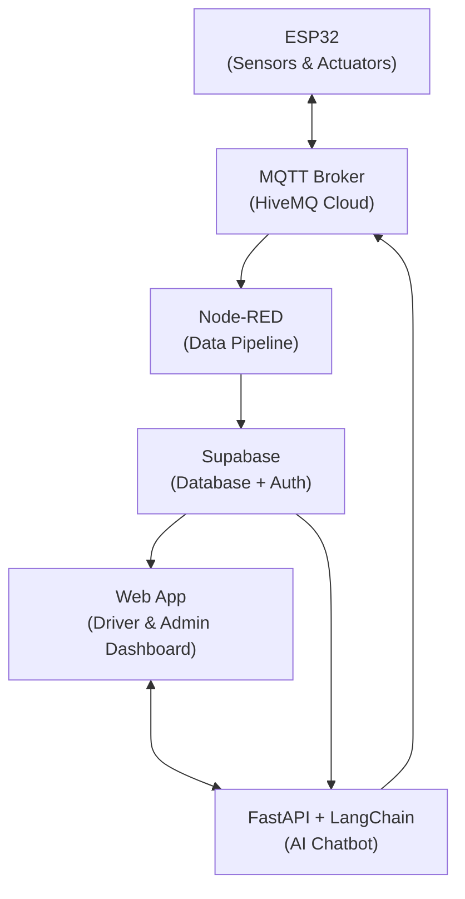

# 🅿️ Smart Parking System

> **An IoT-powered smart parking solution — starting at SRMIST KTR, scaling to campuses everywhere.**

A fully connected IoT ecosystem that brings real-time parking intelligence to college campuses. Built first for **SRM Institute of Science and Technology, Kattankulam (KTR)**, with a roadmap to expand across institutions — combining sensor networks, cloud pipelines, and an AI assistant into one seamless experience.

---

## 🏫 Deployment Roadmap

| Phase | Campus | Status |
|---|---|---|
| **Phase 1** | SRMIST KTR | 🟡 In Development |
| **Phase 2** | Other SRM Campuses | 🔜 Planned |
| **Phase 3** | Other Colleges & Universities | 🔜 Planned |

---

## 📖 Overview

College parking is a daily pain point. Vehicles circle endlessly looking for spots, gates back up during peak hours, and there's no real-time visibility for drivers or campus administration. This system fixes that.

The Smart Parking System for SRMIST KTR provides:
- **Live slot availability** across all monitored zones
- **Automated gate control** based on real occupancy
- **Environment-aware automation** — night lighting and rain protection built in
- **A natural language chatbot** to query parking status conversationally
- **A web dashboard** for drivers and admins

---

## ⚙️ Tech Stack

| Layer | Technology | Role |
|---|---|---|
| **Edge** | ESP32 | Sensor readings, actuator control, MQTT publishing |
| **Messaging** | HiveMQ Cloud | Secure MQTT broker (device ↔ cloud) |
| **Pipeline** | Node-RED | MQTT → Supabase data flow |
| **Backend** | Supabase (Postgres + Auth) | Database + user authentication |
| **Frontend** | Web App | Live status dashboard + gate control |
| **AI Layer** | FastAPI + LangChain | Natural language chatbot interface |

---

## 🛠️ Hardware Components

| Component | Quantity | Function |
|---|---|---|
| IR / PIR Sensors | 4 | Detect slot occupancy |
| RGB LED Pairs | 4 | 🟢 Free / 🔴 Occupied indicators |
| Gate Sensors | 2 | Detect vehicles entering/exiting |
| Servo Motors | 2 | Gate barrier + automatic ceiling cover |
| Rain Sensor | 1 | Triggers ceiling close on rainfall |
| LDR Sensor | 1 | Detects darkness for night mode |
| Corner LEDs | — | Night mode ambient lighting |
| Buzzer | 1 | Alerts for full parking / rain / warnings |
| LCD I2C Display | 1 | Shows availability & system status |

---

## 🚦 System Functionalities

### 🔐 User Management
- Students and staff at SRMIST KTR register/login via Supabase Auth
- Role-based access: **Drivers** see availability; **Admins** see full control panel

### 🅿️ Parking Slot Management
- Each slot is continuously monitored by a sensor
- Occupied → LED turns 🔴 &nbsp;&nbsp; Free → LED turns 🟢
- All state changes are published via MQTT and stored in Supabase
- Manual override available via MQTT commands

### 🚪 Gate Control
- Vehicle detected at entrance → gate opens **only if slots are available**
- Vehicle exits → gate opens automatically
- Gate closes after configurable timeout
- All gate events logged to Supabase

### 🌙 Night Mode
- LDR detects darkness → corner LEDs activate automatically
- Manual override: `ON / OFF / AUTO` via MQTT

### 🌧️ Rain Detection
- Rain sensor triggers → ceiling closes, buzzer alerts
- Rain clears → ceiling reopens automatically
- Particularly useful for SRMIST KTR's open-air parking zones

### 🔔 Alerts & Buzzer
- Parking full → buzzer + LCD warning
- Rain detected → buzzer + LCD warning
- All alerts published via MQTT

### 📟 LCD Display
- Real-time available slot count
- Active system mode (Normal / Night / Rain)
- Alert messages

---

## 📡 MQTT Topics (HiveMQ)

| Topic | Purpose |
|---|---|
| `parking/sensors/slots/#` | Slot occupancy updates |
| `parking/sensors/environment` | Light & rain sensor data |
| `parking/actuators/gate` | Gate control & status |
| `parking/actuators/ceiling` | Ceiling control & status |
| `parking/actuators/buzzer` | Buzzer alerts |
| `parking/control/#` | Manual override commands |

---

## 🌐 Cloud Integration

### Node-RED
Runs a flow that subscribes to MQTT topics and pushes real-time events into Supabase.

### Supabase
Stores all persistent data:
- `users` — Registered SRMIST KTR drivers
- `parking_logs` — Entry/exit event logs
- `sensor_data` — Slot, rain, lighting, and gate state history

### Web App
- Live slot availability via MQTT subscription
- Historical data and user auth via Supabase
- Admin panel for manual control and monitoring

### FastAPI Chatbot
Built with FastAPI + LangChain, connected to Supabase for natural language queries:
- *"How many slots are free right now?"*
- *"Show my last 3 parking sessions."*
- *"Is the gate open?"*

Deployed on PythonAnywhere.

---

## 🚀 System Architecture



---

## 🚀 Setup & Deployment

### 1️⃣ ESP32
```cpp
// Update credentials in config.h
#define WIFI_SSID      "SRMIST_KTR_WIFI"
#define MQTT_SERVER    "your-cluster.hivemq.cloud"
#define MQTT_USER      "your_mqtt_user"
#define MQTT_PASSWORD  "your_mqtt_password"
```
Flash the sketch to your ESP32 using Arduino IDE.

### 2️⃣ HiveMQ
- Create a free [HiveMQ Cloud](https://www.hivemq.com/mqtt-cloud-broker/) account
- Copy the cluster URL, username, and password into your ESP32 config

### 3️⃣ Node-RED
```bash
# Import node-red-flow.json into your Node-RED instance
# Configure the Supabase REST node:
SUPABASE_URL = "https://your-project.supabase.co"
SUPABASE_KEY = "your_service_role_key"
```

### 4️⃣ Supabase
```sql
CREATE TABLE users (id uuid PRIMARY KEY, name text, email text, role text);
CREATE TABLE parking_logs (id serial PRIMARY KEY, user_id uuid, slot_id int, entry_time timestamptz, exit_time timestamptz);
CREATE TABLE sensor_data (id serial PRIMARY KEY, slot_id int, status text, rain boolean, light_level int, gate_open boolean, recorded_at timestamptz);
```
Enable Supabase Auth for registration/login.

### 5️⃣ Web App
```bash
npm install
# .env
VITE_SUPABASE_URL=...
VITE_SUPABASE_ANON_KEY=...
VITE_MQTT_BROKER=wss://your-cluster.hivemq.cloud:8884/mqtt

npm run dev
```

### 6️⃣ FastAPI Chatbot
```bash
pip install fastapi langchain supabase uvicorn
uvicorn main:app --host 0.0.0.0 --port 8000
```

---

## 🗺️ Expansion Plan

After validating the system at **SRMIST KTR**, the plan is to:

1. **Package the system** as a deployable kit (firmware + dashboard + chatbot) any campus can adopt with minimal configuration
2. **Build a multi-campus admin portal** where each college gets its own isolated namespace on shared cloud infrastructure
3. **Add predictive analytics** — peak hour forecasting and average occupancy trends per campus zone
4. **Integrate with campus ID cards / apps** for auto check-in of registered vehicles

If you're from another college and want to pilot this — reach out!

---

## 🤝 Contributing

1. Fork the repository
2. Create your branch: `git checkout -b feature/your-feature`
3. Commit: `git commit -m 'Add your feature'`
4. Push: `git push origin feature/your-feature`
5. Open a Pull Request

---

## 📄 License

This project is licensed under the [MIT License](LICENSE).

---

<p align="center">
  <b>Built at SRMIST KTR 🏫 · Scaling to campuses everywhere 🌐</b>
</p>
